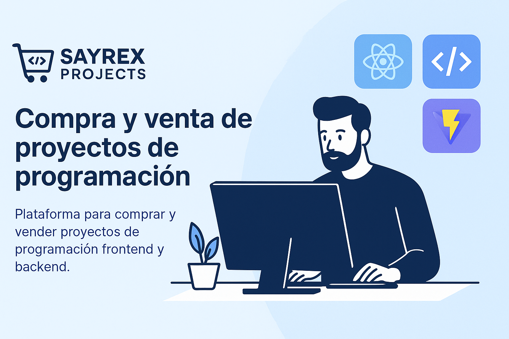

# 💻 Sayrex Projects – Plataforma de Venta de Proyectos de Programación



**Sayrex Projects** es un **marketplace especializado** para la compra y venta de proyectos de código en Java, Python, JavaScript, TypeScript y otros lenguajes. Con un enfoque modular (Backend + Frontend + CRM), ofrece una solución segura y escalable para desarrolladores y compradores.

> 🚀 **Versión actual**: `v1.0.0`  
> 

---

## 📝 Descripción General

**Sayrex Projects** es una plataforma que conecta a desarrolladores con compradores interesados en proyectos de programación en diversos lenguajes. Sus características principales incluyen:
- **Compradores**: Exploran proyectos por lenguaje (Java, Python, JavaScript, etc.), categoría (web, móvil, backend) y nivel (básico, intermedio, avanzado), con opción de comprar y valorar.
- **Vendedores**: Publican proyectos, gestionan su portafolio y revisan estadísticas de ventas.
- **Administradores**: Utilizan un CRM para moderar proyectos, gestionar usuarios y generar reportes.

El sistema está compuesto por:
- **Backend**: APIs RESTful en Spring Boot para gestionar usuarios, proyectos, ventas y autenticación.
- **Frontend**: Interfaz en React + Vite + TypeScript para una experiencia de usuario moderna.
- **CRM**: Panel administrativo en React para supervisión y análisis de la plataforma.

---

## 🌟 Visión General
**Sayrex Projects conecta a desarrolladores con compradores** mediante:
- ✅ **Proyectos listos para usar**: Desde CRUDs hasta aplicaciones completas.
- ✅ **Licencias claras**: MIT, GPL o personalizadas para uso comercial/educativo.
- ✅ **Calidad garantizada**: Escaneo de código con SonarQube y moderación activa.

**Beneficios clave**:
- Para **vendedores**: Monetiza tus proyectos secundarios.
- Para **compradores**: Acelera tu desarrollo con código probado.
- Para **empresas**: Encuentra soluciones técnicas pre-construidas.

---

## 📐 Arquitectura del Sistema

### Diagrama de Componentes


**Capas principales**:
1. **Frontend**: Aplicación React con Vite
2. **Backend**: API REST con Spring Boot
3. **Persistencia**: MySQL + AWS S3 para backups
4. **Integraciones**: Stripe (pagos), SonarQube (calidad)

### Flujo de Compra


**Proceso clave**:
1. Búsqueda → Selección → Pago → Descarga
2. Validación automática de código
3. Notificaciones en tiempo real

---

## 🛠️ Stack Tecnológico

### Backend
| Categoría       | Tecnologías                          | Uso específico                     |
|-----------------|-------------------------------------|------------------------------------|
| **Lenguaje**    | Java 21                             | Base del sistema                   |
| **Framework**   | Spring Boot (Web, Data JPA, Security) | Desarrollo de API REST            |
| **Database**    | MySQL + Hibernate                   | Almacenamiento y gestión de datos  |
| **Productividad**| Lombok                             | Reducción de código boilerplate    |
| **Build**       | Maven                              | Gestión de dependencias            |
| **Documentación**| Swagger/OpenAPI                    | Documentación interactiva de APIs  |
| **Seguridad**   | JWT                                | Autenticación de usuarios          |

### Frontend (Marketplace)
| Categoría       | Tecnologías                          | Uso específico                     |
|-----------------|-------------------------------------|------------------------------------|
| **Core**        | React 18 + Vite                     | Renderizado dinámico               |
| **Tipado**      | TypeScript                          | Seguridad en tipos                 |
| **Estilos**     | Tailwind CSS                        | Diseño responsive                  |
| **HTTP**        | Axios                              | Comunicación con backend           |
| **Routing**     | React Router DOM                    | Navegación SPA                     |
| **Gráficos**    | Recharts                           | Visualización de datos             |
| **Formularios** | React Hook Form + Zod               | Validación de inputs               |
| **UI/UX**       | SweetAlert2/Toastify               | Notificaciones interactivas        |

### CRM Administrativo
| Categoría       | Tecnologías                          | Uso específico                     |
|-----------------|-------------------------------------|------------------------------------|
| **Core**        | React 18 + Vite + TypeScript        | Base del panel de control          |
| **Seguridad**   | JWT + Context API                   | Protección de rutas                |
| **Visualización**| Recharts                           | Reportes y métricas                |
| **Gestión**     | React Router DOM                    | Navegación interna                 |
| **Estilos**     | Tailwind CSS                        | Diseño consistente                 |


## 🎯 Funcionalidades Clave

### Para Compradores
- 🔍 **Búsqueda inteligente**: Filtra por lenguaje, precio o rating.
- 👀 **Previsualización**: Demos en vivo con StackBlitz.
- ⭐ **Sistema de reviews**: Feedback de compradores verificados.

### Para Vendedores
- 📊 **Dashboard**: Estadísticas de ventas y popularidad.
- 🔄 **Control de versiones**: Actualiza tus proyectos (v1.0 → v2.0).
- 💬 **Soporte post-venta**: Ofrece ayuda personalizada.

### Para Administradores
- 🛡️ **Moderación**: Revisión manual/automática de proyectos.
- 📈 **Analíticas**: Tendencias de demanda por tecnología.
- 📝 **Reportes**: Exporta datos en CSV/PDF.

---

## 📊 Modelo de Negocio
| Fuente de Ingresos       | Descripción                                  |
|--------------------------|---------------------------------------------|
| **Comisión por venta**   | 10-20% del precio del proyecto             |
| **Suscripciones Premium**| Acceso a proyectos exclusivos ($10/mes)    |
| **Publicidad**           | Anuncios de herramientas de desarrollo     |

---

## 🚀 Diferenciadores Competitivos
| Feature               | Sayrex Projects | Competidores |
|-----------------------|----------------|-------------|
| **Código verificado** | ✅ SonarQube   | ❌           |
| **Sandbox de pruebas**| ✅ Docker/StackBlitz | ❌ |
| **Soporte integrado** | ✅ Chat/Video  | ❌           |

---

## 👥 User Personas
### 🎓 Estudiante de Programación
- **Necesidad**: Proyectos bien documentados para aprender.
- **Sayrex**: Ofrece proyectos con tutoriales en video.

### 🏢 Startup Tech
- **Necesidad**: MVP rápido con licencia comercial.
- **Sayrex**: Proyectos escalables + soporte técnico opcional.

---

## 📁 Estructura del Proyecto

```
sayrex/
├── backend/
│   ├── src/main/java/com/sayrex/backend/
│   │   ├── BackendApplication.java
│   │   ├── config/          # JWT, CORS, Swagger
│   │   ├── controller/      # Controladores REST
│   │   ├── dto/            # Objetos de transferencia
│   │   ├── exception/       # Manejo de errores
│   │   ├── model/          # Entidades JPA
│   │   ├── repository/     # Interfaces JPA
│   │   ├── security/       # Seguridad y JWT
│   │   └── service/        # Lógica de negocio
│   ├── src/main/resources/
│   │   ├── application.properties
│   │   └── static/
│   └── pom.xml
├── frontend/
│   ├── public/             # Archivos estáticos
│   ├── src/
│   │   ├── assets/         # Imágenes, íconos
│   │   ├── components/     # Componentes reutilizables
│   │   ├── pages/          # Vistas (Home, Proyecto, etc.)
│   │   ├── services/       # Conexión con backend
│   │   ├── context/        # Estado global
│   │   ├── routes/         # Rutas protegidas
│   │   ├── hooks/          # Hooks personalizados
│   │   ├── App.tsx
│   │   └── main.tsx
│   ├── tsconfig.json
│   ├── tailwind.config.js
│   ├── vite.config.ts
│   └── package.json
├── crm/
│   ├── src/
│   │   ├── components/     # Sidebar, Cards, Charts
│   │   ├── pages/          # Dashboard, Usuarios, Proyectos
│   │   ├── services/       # Conexión con backend
│   │   ├── context/        # Autenticación
│   │   ├── App.tsx
│   │   └── main.tsx
│   ├── tsconfig.json
│   ├── tailwind.config.js
│   ├── vite.config.ts
│   └── package.json
└── README.md
```

---

## 🔧 Instalación Rápida
1. **Backend**:
   ```bash
   mvn spring-boot:run
   ```
2. **Frontend**:
   ```bash
   npm run dev
   ```
3. **CRM**:
   ```bash
   npm run dev -- --port 5174
   ```

---

## 🚧 Roadmap
| Fase  | Hito                              | Timeline   |
|-------|-----------------------------------|-----------|
| MVP   | Catálogo básico + pagos           | 3 meses   |
| v2.0  | Sistema de reviews + búsqueda     | 6 meses   |
| v3.0  | Sandbox de pruebas integrado      | 12 meses  |

---

## 📸 Capturas de Pantalla
  
*Ejemplo: Catálogo de proyectos filtrado por Python*

---

## 📄 Licencia
MIT License © 2024 [Cristhian Paul Calloquispe Cusi](mailto:sayrex.dev@gmail.com)
